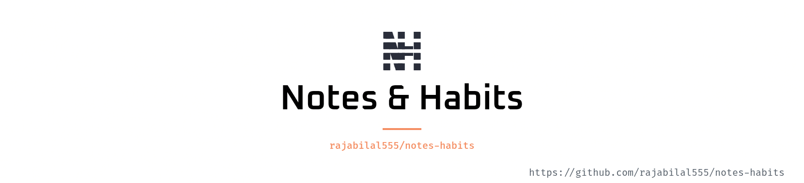

<picture>
   <source media="(prefers-color-scheme: dark)" srcset="art/header-dark.png">
   
</picture>

A small open-source app for jotting notes and keeping daily habits honest. Self-host it, or run it locally.

## Features

- **Notes** — rich text, labels, colours, reminders, pin, and archive
- **Habits** — daily check-ins with a heatmap
- **Dashboard** — what’s due today in one place

## Requirements

- PHP 8.3+
- Composer
- Node.js 20+
- SQLite (default)

## Local setup

```bash
git clone https://github.com/rajabilal555/notes-habits.git
cd notes-habits
composer run setup
composer run dev
```

Open [http://localhost:8000](http://localhost:8000) and create an account.

## Docker

Copy `.env.example` to `.env`, set `APP_DOMAIN`, then:

```bash
docker compose up -d --build
```

## Stack

Laravel · Inertia · React · Tailwind CSS

## License

MIT
